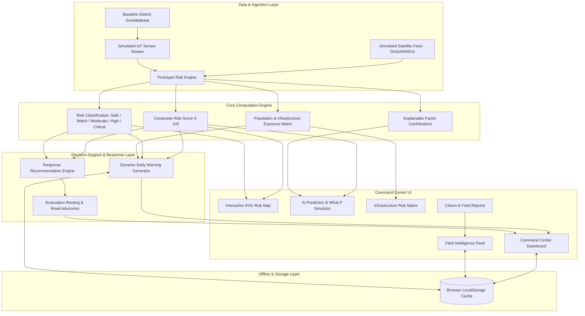

# BHUSHAKTI AI — Complete Technical Documentation
**AI-Based Early Warning & Landslide Risk Monitoring System for Northeast India**  
*SIH 2026 Prototype · Predict. Prepare. Protect.*

---

## 1. Executive Summary

**BHUSHAKTI AI** is a simulated disaster-intelligence decision-support prototype developed for the **Smart India Hackathon (SIH 2026)**. It addresses the critical geological challenge of rainfall-induced landslides across the vulnerable mountain terrains of Northeast India (Arunachal Pradesh, Meghalaya, Sikkim, Nagaland, Manipur, and Mizoram).

The platform integrates multi-factor environmental telemetry, simulated satellite radar/optical indices, population demographics, and infrastructure connectivity into an explainable, real-time risk assessment and early warning engine.

---

## 2. Technology Stack

### A. Frontend Core & Build Tooling
- **React 18.3.1**: Component-driven declarative UI framework utilizing modern React Hooks (`useState`, `useEffect`, `useMemo`, `useRef`, `useCallback`).
- **JavaScript (ES6+ Modules)**: Modern modular ECMAScript architecture with zero legacy runtime overhead.
- **Vite 5.4.x**: Next-generation lightning-fast frontend tooling and bundle optimizer with Hot Module Replacement (HMR) and Rollup-based production builds.

### B. Styling & Design System
- **Tailwind CSS 3.4.x**: Utility-first CSS framework customized for a command-center dark mode (`slate-950`/`slate-900` palettes with `cyan-400` radar accents).
- **PostCSS 8.4.x & Autoprefixer 10.4.x**: Automated CSS cross-browser compatibility and vendor prefixing.
- **Google Web Fonts**:
  - **Manrope**: Bold headings, key metrics, and risk KPI figures.
  - **Inter**: Clean, legible UI typography for operational clarity.
  - **JetBrains Mono**: Telemetry streams, coordinate readouts, timestamps, and mathematical scores.
- **Glassmorphism & Micro-animations**: Backdrop blur filters, pulsing SVG radar sweeps, and smooth CSS transitions.

### C. Data Visualizations & Icons
- **Recharts 2.12.7**: Declarative charting library for responsive SVG visualizations:
  - `LineChart` & `Line`: 24-hour predictive trend curves and animated sparklines.
  - `AreaChart` & `Area`: Regional risk trajectories and continuous scenario timelines.
  - `BarChart`, `Bar` & `Cell`: Categorical alert severity distributions.
  - `ResponsiveContainer`: Automatic container-aware viewport scaling.
- **Lucide React 0.383.0**: Clean, feather-style SVG icon set covering environmental, geographical, network, and emergency disaster operations.

### D. Core Intelligence & Simulation Engines
1. **Prototype Risk Engine (`src/engine/riskEngine.js`)**:
   - Multi-factor weighted hazard algorithm.
   - Explainable SHAP-like attribution breakdown.
   - 5-tier standard risk classification.
2. **Controlled Simulation Engine (`src/engine/simulationEngine.js`)**:
   - Harmonic atmospheric waveform and hydrological inertia modeling.
   - 13-step deterministic Disaster Simulation scenario engine.
3. **Response Recommendation Engine (`src/engine/riskEngine.js`)**:
   - Transparent, rule-based decision-support matrix producing actionable mitigation guidance.
4. **Storage & Offline Engine (`src/engine/storageEngine.js`)**:
   - Fail-safe browser `localStorage` caching and state synchronization for offline continuity.

### E. Geospatial & Map Engine
- **Custom SVG Coordinate GIS Engine**: Lightweight, dependency-free topological map rendering Northeast India's district nodes, connecting highway corridors, animated severity rings, and interactive inspection drawers.

---

## 3. System Architecture & Data Flow



---

## 4. Mathematical Model & Risk Scoring Formulations

### Composite Weighted Risk Formula
The prototype risk score is calculated as a normalized linear combination of 7 key environmental, geomorphological, and anthropogenic factors:

$$\text{Risk Score} (S) = \sum_{i=1}^{n} \left( w_i \times F_i \right)$$

Where:
- $F_i$: Normalized factor value ($0 \le F_i \le 100$)
- $w_i$: Relative weight assigned to factor $i$ ($\sum w_i = 1.00$)

| Factor Key | Factor Name | Weight ($w_i$) | Physical Meaning | Sensor / Data Source |
| :--- | :--- | :---: | :--- | :--- |
| `rainfall` | Rainfall Intensity | **0.28 (28%)** | Real-time precipitation rate & 72h accumulation | AWS / Doppler Radar (Simulated) |
| `soil` | Soil Moisture Saturation | **0.22 (22%)** | Subsurface volumetric moisture & pore pressure | In-situ Piezometers (Simulated) |
| `slope` | Slope Gradient | **0.18 (18%)** | Topographic steepness & shear stress potential | CartoDEM / ALOS PALSAR |
| `historical` | Historical Frequency | **0.12 (12%)** | Documented recurring landslide events | GSI Landslide Inventory |
| `veg` | Vegetation Loss | **0.10 (10%)** | Canopy degradation & root cohesion loss | Sentinel-2 NDVI (Simulated) |
| `road` | Road Cutting Impact | **0.06 (6%)** | Toe excavation & slope destabilization | BRO / NHIDCL Geodatabase |
| `satellite` | Satellite Displacement | **0.04 (4%)** | Millimetric surface displacement | Sentinel-1 DInSAR (Simulated) |

---

### Severity Classification Thresholds

$$\text{Severity Level} = \begin{cases} 
\text{CRITICAL (Red Alert)} & 80 \le S \le 100 \\
\text{HIGH (Orange Alert)} & 60 \le S < 80 \\
\text{MODERATE (Yellow Advisory)} & 40 \le S < 60 \\
\text{WATCH (Blue Watch)} & 20 \le S < 40 \\
\text{SAFE (Green Normal)} & 0 \le S < 20 
\end{cases}$$

---

### Explainable Attribution (SHAP-like Contribution Share)
For each district, individual factor percentage shares are computed to explain **why** the AI predicts a specific risk level:

$$\text{Contribution Pct}_k = \left( \frac{w_k \times F_k}{\sum_{i=1}^{n} w_i \times F_i} \right) \times 100$$

---

## 5. Key Feature Documentation

### 1. Command Center & Regional Risk Gauges
- Displays aggregate regional risk computed from the active district network ($55\%$ max + $45\%$ average).
- Live KPI cards tracking active IoT sensors, monitored zones, total exposed population, infrastructure assets at risk, high-risk zones, and critical zones.
- Real-time simulation status dock displaying the active disaster scenario phase and operational response status (`STANDBY`, `MONITORING`, `TRAVEL_ADVISORY_ISSUED`, `RED_ALERT_TRIGGERED`, `DEPLOYED`).

### 2. Interactive SVG Risk Map
- Spatial rendering of all 10 monitored districts across Northeast India.
- Dynamic color-coding and animated pulsing rings for nodes in `HIGH` or `CRITICAL` state.
- Clicking any node opens the comprehensive Location Intelligence Drawer.

### 3. Location Intelligence Drawer
- Comprehensive district dossier providing:
  - **Risk Gauge**: Real-time score and level badge.
  - **Environmental Telemetry**: Temperature (°C), Humidity (%), Rain Rate (mm/h), Pore Water Pressure (kPa).
  - **Satellite Intelligence**: Vegetation Loss (%), InSAR Slope Deformation (mm), Terrain Disturbance, Debris Detection, Road Blockage.
  - **Exposure Matrix**: Demographic population count, roads affected, bridges, schools, hospitals, power assets, and vulnerable villages.
  - **Explainability**: Factor contribution ranking, natural-language explanation, and actionable mitigation guidance.

### 4. What-If Risk Simulator
- Interactive parameter sliders allowing operators to simulate hypothetical climate and anthropogenic scenarios:
  - Rainfall Intensity (`0–100`)
  - Soil Moisture Saturation (`0–100%`)
  - Slope Gradient (`0–100`)
  - Vegetation Loss (`0–100%`)
  - Road Cutting Impact (`0–100`)
- **Quick Scenario Presets**: 🌧️ Heavy Rainfall (+20%), 🌲 Vegetation Loss (+30%), 🚜 Road Cutting (+35%), 🛡️ Slope Stabilization (-15%).
- **Comparison Grid**: Current Baseline vs. Projected Risk vs. Risk Delta vs. AI Recommended Guidance.

### 5. Dynamic Early Warning & Alert Management
- Live severity alerts dynamically filtered for districts with risk score $\ge 40$.
- Detailed alert cards with exposed population, infrastructure breakdown, primary triggers, and decision-support guidance.
- Operator acknowledgment logging with persistence in `localStorage`.
- Multi-channel emergency broadcast simulator (SMS, Radio, App, Public Display).

### 6. Infrastructure & Evacuation Routing
- Regional infrastructure risk breakdown tracking exposed highway corridors, bridges, schools, hospitals, and power substations.
- Highway corridor vulnerability matrix with blockage probabilities and detour options.
- AI-assisted evacuation shelter routing with capacity matching and shortest-open-path prioritization (e.g. Shelter A Anini Community Hall).

### 7. Citizen & Field Reporting Portal
- Dual-channel intelligence platform allowing field teams and citizens to report ground observations (Landslides, Slope Cracks, Rockfalls, Road Blockages, Flooding).
- Interactive verification workflow with status **`UNDER REVIEW`**.
- Automatic persistence in browser `localStorage`.

### 8. 13-Step Controlled Disaster Simulation Engine
- Main SIH demo feature implementing a deterministic 30–60 second disaster lifecycle.
- Step controls: Play, Pause, Reset, and Speed Multipliers (1x, 2x, 4x).
- Sequence: Baseline Standby $\to$ Rainfall Surge $\to$ Soil Saturation $\to$ High Risk $\to$ Satellite InSAR Warning $\to$ Critical Red Alert $\to$ Population Exposure $\to$ Evacuation Order $\to$ Response Status **DEPLOYED**.

### 9. BhuShakti Copilot
- Natural-language decision-support assistant answering operational queries regarding district risk status, vulnerable highways, recent changes, and evacuation recommendations.

### 10. Lightweight Offline Support
- Automatic serialization of active districts, field reports, alert acknowledgments, and synchronization timestamps to `localStorage`.
- Offline banner notifying operators of local caching with one-click manual synchronization.

---

## 6. Project Directory Structure

```
BHUSHAKTI-AI/
├── dist/                          # Production build output
├── node_modules/                  # Installed dependencies
├── public/                        # Static assets & public media
├── src/
│   ├── data/
│   │   └── districtsData.js       # NER geodatabase, baselines, highway corridors & shelters
│   ├── engine/
│   │   ├── riskEngine.js          # Multi-factor risk scoring, SHAP attribution & recommendations
│   │   ├── simulationEngine.js    # Harmonic telemetry feed & 13-step disaster scenario
│   │   └── storageEngine.js       # LocalStorage persistence & offline cache utilities
│   ├── App.jsx                    # Core application layout, navigation & views
│   ├── index.css                  # Tailwind directives & custom CSS tokens
│   └── main.jsx                   # React root entrypoint
├── index.html                     # Main HTML template with responsive meta tags
├── package.json                   # Project dependencies and npm scripts
├── postcss.config.js              # PostCSS configuration
├── tailwind.config.js             # Tailwind CSS theme & configuration
├── vite.config.js                 # Vite development and bundle configuration
├── DOCUMENTATION.md               # Complete Technical Documentation
└── walkthrough.md                 # Implementation Walkthrough & Verification Artifact
```

---

## 7. How to Run Locally

### Prerequisites
- Node.js (v18.0.0 or higher)
- npm (v9.0.0 or higher)

### Step 1: Install Dependencies
```bash
npm install
```

### Step 2: Start Development Server
```bash
npm run dev
```
The application will launch on `http://localhost:5173/` (or `http://localhost:5174/`).

### Step 3: Build for Production
```bash
npm run build
```
Creates an optimized production bundle in the `dist/` directory.

### Step 4: Preview Production Bundle
```bash
npm run preview
```

---

## 8. AI/ML Transparency & Prototype Disclaimers

1. **Prototype Decision-Support**: All mathematical formulas, satellite indicators, and response recommendations are generated by the prototype risk engine and rule-based decision matrices for demonstration purposes.
2. **Simulated Telemetry**: Environmental feeds represent physically coherent simulated waveforms calibrated to Northeast India's topography.
3. **Production Roadmap**: Future production versions will integrate live IMD Doppler radar APIs, ISRO/Sentinel DInSAR interferometry pipelines, physical MEMS wireless sensor meshes, and trained GeoAI ML models (FastAPI / PostGIS / XGBoost / PyTorch).
