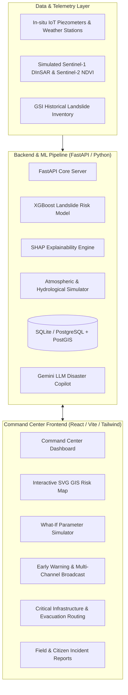

# 🏔️ BHUSHAKTI AI
### **AI-Powered Landslide Early Warning & Decision Support System for Northeast India**
*Smart India Hackathon (SIH 2026) Prototype · Predict. Prepare. Protect.*

---

## 📌 Overview
**BHUSHAKTI AI** is an end-to-end intelligent disaster management platform engineered to predict, monitor, and mitigate rainfall-induced landslides across the vulnerable mountain terrains of Northeast India (Arunachal Pradesh, Meghalaya, Sikkim, Nagaland, Manipur, and Mizoram).

The system combines **multi-factor environmental telemetry, real-time satellite remote sensing indices (DInSAR/NDVI), machine learning models (XGBoost), SHAP explainability, automated emergency warning broadcasts, and interactive GIS geospatial intelligence** into an actionable operational command center.

---

## 🏛️ System Architecture



---

## 🚀 Key Features

1. **Integrated Command Center Dashboard**: Real-time regional risk gauges, active sensor telemetry, exposed population metrics, and 13-step disaster simulation playback.
2. **Interactive GIS Topological Risk Map**: Visual representation of Northeast Indian districts with dynamic risk pulsing rings and detailed location intelligence dossiers.
3. **Machine Learning & What-If Scenario Simulator**:
   - Pre-trained **XGBoost** classification & regression pipeline.
   - Interactive slider simulations (Rainfall, Soil Moisture, Slope Gradient, Vegetation Loss, Road Excavation).
   - **SHAP-like factor contribution** breakdown explaining why a risk score was assigned.
4. **Automated Multi-Channel Early Warning System**: Instant critical alerts with mitigation recommendations and multi-channel broadcast simulators (SMS, Radio, App, Public Display).
5. **Critical Infrastructure & Evacuation Routing**: Real-time status of highway corridors (NH-13, NH-10, NH-29, NH-54), hospitals, schools, and capacity-matched emergency shelters.
6. **Citizen & Ground Field Reporting**: Verification workflows for crowd-sourced and ranger field hazard reports.
7. **BhuShakti AI Disaster Copilot**: Context-aware natural-language assistant powered by LLM decision-support matrices.

---

## 📁 Repository Structure

```
.
├── BHUSHAKTI-AI/              # Frontend Web Application (React + Vite + Tailwind CSS)
│   ├── src/
│   │   ├── data/              # Geodatabase, baselines, highway corridors
│   │   ├── engine/            # Risk scoring, simulation, and local storage engines
│   │   ├── pages/             # CommandCenter, RiskMap, Prediction, Warnings, Infra, Copilot
│   │   ├── services/          # Backend API client integration
│   │   ├── App.jsx            # Main application layout and routing
│   │   └── main.jsx           # React root entrypoint
│   ├── package.json
│   ├── vite.config.js
│   └── tailwind.config.js
│
├── backend/                   # Backend REST API (FastAPI + SQLAlchemy)
│   ├── app/
│   │   ├── core/              # App configuration & environment settings
│   │   ├── database/          # Database models and session management
│   │   ├── models/            # SQLAlchemy database entities
│   │   ├── routes/            # API endpoints (Risk, Weather, Warnings, Copilot, Infra)
│   │   ├── schemas/           # Pydantic data validation schemas
│   │   ├── services/          # ML inference, SHAP service, Alert & Weather engines
│   │   └── utils/             # Geoutils and database seeder
│   ├── requirements.txt
│   └── .env.example
│
├── ml/                        # Machine Learning Pipeline & Datasets
│   ├── data/
│   │   ├── generate_synthetic_data.py   # Synthesizer for Himalayan weather-terrain profiles
│   │   └── historical_landslide_dataset.csv
│   ├── models/
│   │   ├── xgboost_landslide_pipeline.pkl
│   │   └── evaluation_metrics.json
│   ├── train_model.py         # Pipeline training script
│   ├── evaluate_model.py      # Model metrics & validation
│   └── explain_prediction.py  # SHAP feature importance analysis
│
├── .gitignore                 # Root gitignore excluding node_modules, build, .env, DB
└── README.md                  # Project overview & documentation
```

---

## 🛠️ Quick Start Guide

### Prerequisites
- **Node.js** (v18.0.0 or higher) & **npm**
- **Python** (v3.10 or higher) & **pip**

---

### 1. Frontend Setup (`BHUSHAKTI-AI`)

```bash
# Navigate to frontend directory
cd BHUSHAKTI-AI

# Install dependencies
npm install

# Start local development server
npm run dev
```
> Open [http://localhost:5173](http://localhost:5173) in your browser.

---

### 2. Backend Setup (`backend`)

```bash
# Navigate to backend directory
cd backend

# Create and activate virtual environment (Optional but recommended)
python -m venv venv
# Windows:
.\venv\Scripts\activate
# Linux/macOS:
# source venv/bin/activate

# Install dependencies
pip install -r requirements.txt

# Create .env from template
copy .env.example .env

# Run database seeder (initializes database with Northeast India baseline data)
python -m app.utils.seeder

# Start FastAPI server
uvicorn app.main:app --reload --host 0.0.0.0 --port 8000
```
> Access Swagger API docs at [http://localhost:8000/docs](http://localhost:8000/docs).

---

### 3. Machine Learning Pipeline (`ml`)

```bash
# Navigate to ml directory
cd ml

# Generate synthetic landslide dataset
python data/generate_synthetic_data.py

# Train XGBoost pipeline
python train_model.py

# Evaluate model performance
python evaluate_model.py
```

---

## 📊 Risk Computation Formulation

The composite landslide risk score ($S$) is calculated as:

$$\text{Risk Score} (S) = \sum_{i=1}^{n} \left( w_i \times F_i \right)$$

| Factor | Description | Weight |
| :--- | :--- | :---: |
| **Rainfall Intensity** | 24h & 72h precipitation accumulation rate | **28%** |
| **Soil Moisture** | Volumetric soil water saturation & pore water pressure | **22%** |
| **Slope Gradient** | Topographical steepness | **18%** |
| **Historical Frequency** | Past documented landslide occurrences | **12%** |
| **Vegetation Loss** | Canopy degradation index (NDVI) | **10%** |
| **Road Cutting Impact** | Anthropogenic toe excavation | **6%** |
| **Satellite InSAR** | Millimetric slope deformation | **4%** |

---

## 📄 License
This project is developed for the **Smart India Hackathon (SIH 2026)**.
Licensed under the [MIT License](LICENSE).
